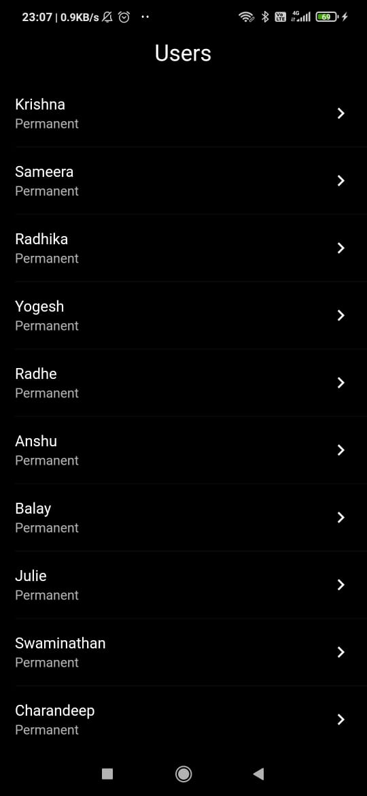
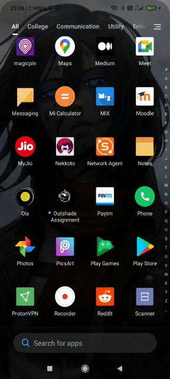
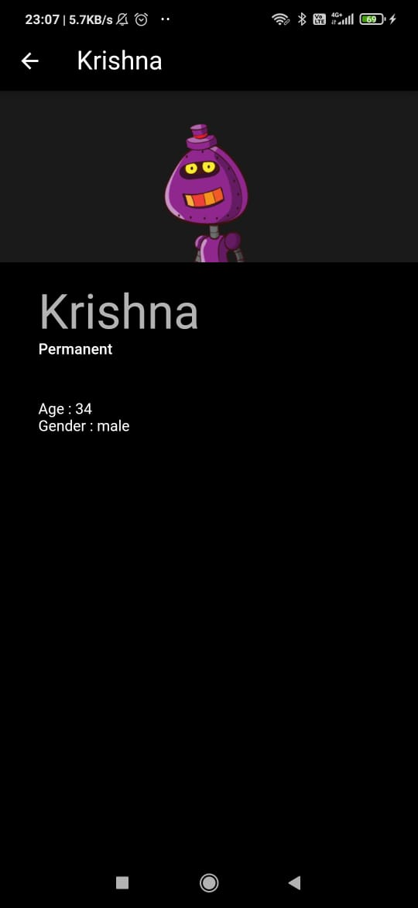

# Outshade Assignment

[![style: very good analysis][very_good_analysis_badge]][very_good_analysis_link]
[](https://github.com/AshishSingh2001/outshade-assignment/actions/workflows/main.yaml)


Generated by the [Very Good CLI][very_good_cli_link] 🤖

Flutter Assignment for Outshade Digital Media

## 💻 Technologies Used

- Flutter
- Bloc
- Freezed
- Dart

## Screenshots

<p align="center">
    
    </img>
    
    </img>
    
    </img>
</p>


---

## Getting Started 🚀

This project contains 3 flavors:

- development
- staging
- production

To run the desired flavor either use the launch configuration in VSCode/Android Studio or use the following commands:

```sh
# Development
$ flutter run --flavor development --target lib/main_development.dart

# Staging
$ flutter run --flavor staging --target lib/main_staging.dart

# Production
$ flutter run --flavor production --target lib/main_production.dart
```

_\*Outshade Assignment works on iOS, Android, and Web._

---

[very_good_analysis_badge]: https://img.shields.io/badge/style-very_good_analysis-B22C89.svg
[very_good_analysis_link]: https://pub.dev/packages/very_good_analysis
[very_good_cli_link]: https://github.com/VeryGoodOpenSource/very_good_cli
